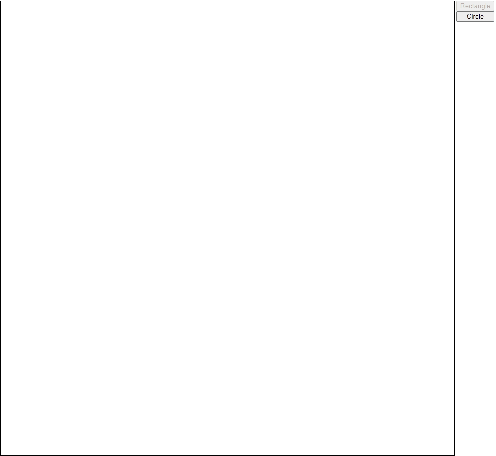
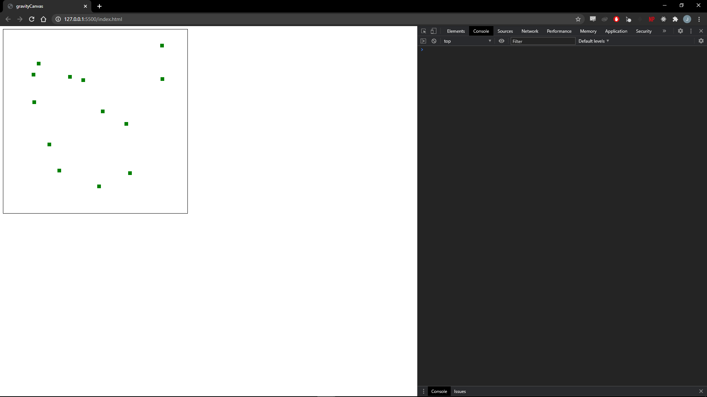

# gravityCanvas
A canvas that is affected by gravity, in vanilla JS with no libraries or frameworks

Download files and open `index.html` in a browser

## Versions
### v0.3
Added circles and buttons to change shape

### v0.2
Added constant gravity

### v0.1
Added very basic user input to draw small green squares based on input

